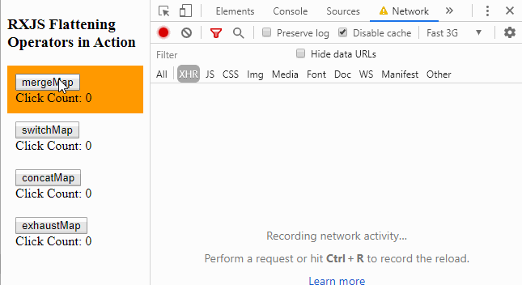

[](https://www.npmjs.com/package/mini-rx-store)
[](https://npmcharts.com/compare/mini-rx-store?interval=30)
[](./LICENSE)
[](https://github.com/spierala/mini-rx-store/actions?query=workflow%3ATests)
[](#contributors-)
[](https://github.com/prettier/prettier)

> **ℹ️  Version 2:** Currently we are working on version 2 of mini-rx-store. Please let us know if you have ideas for features that you wish to see in mini-rx-store@2.  See discussion here: https://github.com/spierala/mini-rx-store/discussions/19

# MiniRx Store 2 (beta)

### FOR 1.X PLEASE GO TO [THE 1.x BRANCH](https://github.com/spierala/mini-rx-store/tree/1.x)

**MiniRx Store** provides Reactive State Management for Javascript Applications inspired by [Redux](https://redux.js.org/).

## MiniRx Features

-   Minimal configuration and setup
-   [Store (Redux)](#store-redux):
    -   Actions
    -   Reducers
    -   Meta Reducers    
    -   Memoized Selectors
    -   Effects
    -   [Support for ts-action](#ts-action): Create and consume actions with as little boilerplate as possible
-   [FeatureStore](#featurestore): Update state without actions and reducers:
    -   `setState()` update the feature state
    -   `select()` read feature state
    -   `effect()` run side effects like API calls and update feature state
    -   `undo()` easily undo setState actions
-   [Extensions](#extensions):
    - Redux Dev Tools Extension: Inspect State with the Redux Dev Tools
    - Immutable Extension: Enforce immutability
    - Undo Extension: Undo dispatched Actions
    - Logger Extension: console.log the current action and updated state
-   [Angular Integration](#angular-integration): Use MiniRx Store the Angular way: `StoreModule.forRoot()`, `StoreModule.forFeature()`, ...    
-   Framework agnostic: MiniRx works with any front-end project built with JavaScript or TypeScript (Angular, React, Vue, or anything else)

## RxJS
MiniRx is powered by [RxJS](https://rxjs.dev/). It uses RxJS Observables to notify subscribers about state changes.

## Redux

MiniRx uses the Redux Pattern to make state management easy and predictable.

The Redux Pattern is based on this 3 key principles:

-   Single source of truth (the Store)
-   State is read-only and is only changed by dispatching actions
-   Changes are made using pure functions called reducers

## TypeScript
MiniRx is TypeScript friendly. If you really want to, you could use MiniRx also in Vanilla JavaScript projects. 
However, MiniRx is so much more fun in a TypeScript environment. 
The code examples below are also written in TypeScript.

## Demos
- [Todos App using FeatureStore](https://stackblitz.com/edit/mini-rx-angular-todos?file=src%2Fapp%2Fmodules%2Ftodo%2Fservices%2Ftodos-state.service.ts)
- Coming soon: Redux Demo

## Installation:

`npm i mini-rx-store@beta`

## Store (Redux):

> Make hard things simple

#### Get hold of the Store:
```ts
import { configureStore, Store } from 'mini-rx-store';

const store: Store = configureStore();
```
At first, we do not have to configure anything.

#### Create a Feature (Feature State):

A _feature_ holds a piece of state which belongs to a specific feature in your application (e.g. 'products', 'users').
The feature states together form the app state (Single source of truth).

Usually you would create a new _feature_ inside long living Modules/Services:

```ts
store.feature<ProductState>('products', productReducer);
```

The code above creates a new feature state for _products_.
`store.feature` receives the feature name, and a reducer function.

Reducers specify how the feature state changes in response to actions sent to the store.
A reducer function typically looks like this:

```ts
export interface ProductState {
    showProductCode: boolean;
    products: Product[];
}

const initialState: ProductState = {
  showProductCode: true,
  products: [],
};

function productReducer(state: ProductState = initialState, action: ProductActions): ProductState {
  switch (action.type) {
    case ProductActionTypes.ToggleProductCode:
      return {
        ...state,
        showProductCode: action.payload
      };

    default:
      return state;
  }
}
```

#### Create Actions:

```ts
import { Action } from 'mini-rx-store';

enum ProductActionTypes {
    Load = '[Product] Load',
    CreateProduct = '[Product] Create Product',
}

class Load implements Action {
    readonly type = ProductActionTypes.Load;
}

class CreateProduct implements Action {
  readonly type = ProductActionTypes.CreateProduct;
  constructor(public payload: Product) { }
}

// Union the valid types
type ProductActions = CreateProduct | Load;
```

#### Dispatch an Action:

Dispatch an action to update state:

```ts
store.dispatch(new CreateProduct(product));
```

After the action has been dispatched the state will be updated accordingly (as defined in the reducer function).

#### Effects:

Effects trigger side effects like API calls and handle the result:

-   An Effect listens for a specific action
-   That action triggers the actual side effect
-   The Effect needs to return a new action as soon as the side effect completed

```ts
import { actions$, ofType } from 'mini-rx-store';
import { mergeMap, map, catchError } from 'rxjs/operators';

store.effect(
    actions$.pipe(
        ofType(ProductActionTypes.Load),
        mergeMap(() =>
            productApiService.getProducts().pipe(
                map(products => (new LoadSuccess(products))),
                catchError(err => of(new LoadFail(err)))
            )
        )
    )
);
```

The code above creates an Effect. As soon as the `Load` action has been dispatched the API call (`productService.getProducts()`) will be executed. Depending on the result of the API call a new action will be dispatched:
`LoadSuccess` or `LoadFail`.

#### Create (memoized) Selectors:

Selectors are used to select and combine state.

```ts
import { createFeatureSelector, createSelector } from 'mini-rx-store';

const getProductFeatureState = createFeatureSelector<ProductState>('products');

const getProducts = createSelector(
    getProductFeatureState,
    state => state.products
);
```

`createSelector` creates a memoized selector. This improves performance especially if your selectors perform expensive computation.
If a selector is called with the same arguments again, it will just return the previously calculated result.

#### Select Observable State (with a memoized selector):

```ts
import { Observable } from 'rxjs';

const products$: Observable<Product[]> = store.select(getProducts);
```

`Store.select` runs the selector against the app state and returns an Observable which will emit as soon as the _products_ data changes.

## ts-action

MiniRx supports writing and consuming actions with [ts-action](https://www.npmjs.com/package/ts-action) to reduce boilerplate code.

There are also [ts-action-operators](https://www.npmjs.com/package/ts-action-operators) to consume actions in Effects.

Install the packages using npm:

`npm install ts-action ts-action-operators`

#### Create an Action:

```ts
import { action, payload } from 'ts-action';

const toggleProductCode = action('[Product] Toggle Product Code', payload<boolean>());
const updateProduct = action('[Product] Update Product', payload<Product>());
const updateProductSuccess = action('[Product] Update Product Success', payload<Product>());
const updateProductFail = action('[Product] Update Product Fail', payload<string>());
```

#### Dispatch an Action:

```ts
store.dispatch(toggleProductCode());
```

#### Reducer

```ts
import { on, reducer } from 'ts-action';

const productReducer = reducer(
    initialState,
    on(toggleProductCode, (state, {payload}) => ({...state, showProductCode: payload})),
    // ...
);
```

#### Effects

Consume actions in Effects

```ts
import { actions$ } from 'mini-rx-store';
import { ofType, toPayload } from 'ts-action-operators';

updateProduct$ = actions$.pipe(
    ofType(updateProduct),
    toPayload(),
    mergeMap((product) => {
        return this.productService.updateProduct(product).pipe(
            map(updatedProduct => (updateProductSuccess(updatedProduct))),
            catchError(err => of(updateProductFail(err)))
        );
    })
);
```

## FeatureStore:

> Make simple things simple

If a feature in your application requires only simple state management, then you can fall back to a simplified API:
With the FeatureStore API you can update state without writing actions and reducers.

#### Create a FeatureStore:
```ts
import { FeatureStore } from 'mini-rx-store';

interface UserState {
    currentUser: User;
    favProductIds: string[];
}

const initialState: UserState = {
  currentUser: undefined,
  favProductIds: []
};

export class UserStateService extends FeatureStore<UserState>{
    constructor() {
        super('users', initialState);
    }
}
```
To create a FeatureStore, you need to extend MiniRx's `FeatureStore` class, passing the feature name as well as its initial state.

#### Select state with `select`
```ts
public currentUser$: Observable<User> = this.select(state => state.currentUser);
```

`select` takes a callback function which gives you access to the current feature state (see the `state` parameter).
Within that function you can pick a specific piece of state.
`select` returns an Observable which will emit as soon as the selected state changes.

#### Select state (with a memoized selector):

You can use memoized selectors also with the FeatureStore... You only have to omit the feature name when using `createFeatureSelector`.
This is because the `FeatureStore` is operating on a specific feature state already (the corresponding feature name has been provided in the constructor).

```ts
const getUserFeatureState = createFeatureSelector<UserState>(); // Omit the feature name!

const getCurrentUser = createSelector(
    getUserFeatureState,
    state => state.currentUser
);


// Inside the User state service
export class UserStateService extends FeatureStore<UserState>{
    currentUser$ = this.select(getCurrentUser);

    constructor() {
        super('products', initialState); // Feature name 'products' is provided here already...
    }
}
```

#### Update state with `setState`
`setState` accepts a Partial Type. This allows us to pass only some properties of a bigger state interface.
```ts
updateUser(user: User) {
    this.setState({currentUser: user});
}
```
Do you need to update the new state based on the current state?
`setState` accepts a callback function which gives you access to the current state.
```ts
// Update state based on current state
addFavorite(productId) {
    this.setState(state => ({
        favProductIds: [...state.favProductIds, productId]
    }));
}
```
For better logging in the JS Console / Redux Dev Tools you can provide an optional name to the `setState` function:

```ts
this.setState({currentUser: user}, 'updateUser');
```

#### Create an Effect with `effect`
`effect` offers a simple way to trigger side effects (e.g. API calls)
and update feature state straight away (by using `setState()`).

Example:

```ts
import { catchError, map, mergeMap } from 'rxjs/operators';
import { of } from 'rxjs';

createProduct = this.effect<Product>((payload$) => {
    return payload$.pipe(
        mergeMap((product) => {
            return productApiService.createProduct(product).pipe(
                tap((newProduct) =>
                    this.setState(
                        {
                            products: [...this.state.products, newProduct],
                            error: '',
                        },
                        'create success'
                    )
                ),
                // Handle potential error within inner pipe.
                catchError((error) => {
                    this.setState({ error }, 'create error');
                    return EMPTY;
                })
            );
        })
    );
});

// Run the effect
createProduct(product);
```

The code above creates an Effect for _creating a product_.
The API call `productApiService.createProduct` is the side effect which needs to be performed.
`effect` returns a function which can be called later to start the Effect with an optional payload (see `createProduct(product)`).

Inside the `payload$.pipe` we can define how to handle the side effect. 
With RxJS flattening operators (mergeMap, switchMap, concatMap, exhaustMap) we can easily define how to treat race conditions (e.g. if you trigger a lot of API calls at the same time).

Inside the RxJS `tap` and `catchError` operators we can call `this.setState()` to update state.

ℹ️ It is important to handle possible API errors with `catchError` to make sure that the `payload$` stream does not die.

**FYI: See how RxJS flattening operators are handling race conditions:**



**FYI: How the FeatureStore works**

The FeatureStore makes use of Redux too:
A FeatureStore is registered in the Store (which is the Single source of truth) and is part of the global application state.
Each FeatureStore exists next to other "Redux" features which have been created using `store.feature()`.
Behind the scenes FeatureStore is creating a default reducer, and a default action in order to update the feature state.
MiniRx dispatches the default action when calling `setState()` and the default reducer will update the feature state accordingly.


## Extensions

Extensions can be registered by providing a config object to the `store`. The `extensions` property accecpts an array of Extension instances.

For example:
```ts
import { ImmutableStateExtension, LoggerExtension} from 'mini-rx-store';

const store: Store = configureStore({
    extensions: [new LoggerExtension(), new ImmutableStateExtension()]
});
```
### Immutable State Extension:
Make sure that the state is not mutated accidentally.
State should only be changed by dispatching an action or by using `setState`.

```ts 
const immutableExt = new ImmutableStateExtension();
```

### Logger Extension:
Enables simple Logging: console.log every action and the updated state.

```ts 
const loggerExt = new LoggerExtension();
```

### Redux Dev Tools Extension:


MiniRx has basic support for the [Redux Dev Tools](https://github.com/zalmoxisus/redux-devtools-extension) (you can time travel and inspect the current state).
You need to install the Browser Plugin to make it work.

-   [Chrome Redux Dev Tools](https://chrome.google.com/webstore/detail/redux-devtools/lmhkpmbekcpmknklioeibfkpmmfibljd)
-   [Firefox Redux Dev Tools](https://addons.mozilla.org/nl/firefox/addon/reduxdevtools/)

Currently, these options are available to configure the DevTools:

-   `name`: the instance name to be shown on the DevTools monitor page.
-   `maxAge`: maximum allowed actions to be stored in the history tree. The oldest actions are removed once maxAge is reached. It's critical for performance. Default is 50.
-   `latency`: if more than one action is dispatched in the indicated interval, all new actions will be collected and sent at once. Default is 500 ms.

```ts
import { ReduxDevtoolsExtension } from 'mini-rx-store';

const devToolsExt = new ReduxDevtoolsExtension({
    name: 'MiniRx Showcase',
    maxAge: 25,
    latency: 1000
});
```

### Undo Extension
TODO

## Angular Integration
[](https://www.npmjs.com/package/mini-rx-store-ng)

Use MiniRx Store the Angular way:

- [Configure the store](#register-the-store-in-the-app-module) using `StoreModule.forRoot()`
- [Register Feature States](#register-feature-states-in-angular-feature-modules) using `StoreModule.forFeature()`
- [Register Effects](#register-effects) using `EffectsModule.register()`
- [Use Angular Dependency Injection](#get-hold-of-the-store-and-actions-via-the-angular-dependency-injection) for `Store` and `Actions`
- [Redux Devtools Extension](#redux-dev-tools)

## Usage

### Installation:

`npm i mini-rx-store-ng`

### Register the Store in the App Module
```ts
import { StoreModule } from 'mini-rx-store-ng';

@NgModule({
    imports: [
        StoreModule.forRoot({
            extensions: [
                // Add extensions here
                // new LoggerExtension()
            ],
            reducers: {
                // Add root reducers here
                // user: userReducer
            },
            metaReducers: [
                // Add root meta reducers
            ]
        }),
    ]
})
export class AppModule {}
```

### Register Feature States in Angular Feature Modules

```ts
import { StoreModule } from 'mini-rx-store-ng';

@NgModule({
    imports: [
        StoreModule.forFeature('products', productReducer),
    ]
})
export class ProductModule {
    constructor() {}
}
```

### Register Effects
```ts
// product-effects.service.ts
import { Actions } from 'mini-rx-store';

@Injectable({ providedIn: 'root' })
export class ProductEffects {
    constructor(
        private productService: ProductService, 
        private actions$: Actions
    ) {
    }

    loadProducts$ = this.actions$.pipe(
        ofType(load),
        mergeMap((action) =>
            this.productService.getProducts().pipe(
                map((products) => loadSuccess(products)),
                catchError((err) => of(loadFail(err)))
            )
        )
    );
}    
```
```ts 
// product.module.ts
import { EffectsModule, StoreModule } from 'mini-rx-store-ng';

@NgModule({
    imports: [
        StoreModule.forFeature('products', productReducer),
        EffectsModule.register([ProductEffects]),
    ]
})
export class ProductModule {
    constructor() {}
}
```
The `register` method from the EffectsModule accepts an array of classes with effects and can be used in both, root and feature modules.

### Get hold of the store and actions via the Angular Dependency Injection
After we registered the StoreModule in the AppModule we can use Angular DI to access `Store` and `Actions`.

For example in a component:
```ts
import { Component } from '@angular/core';
import { Store } from 'mini-rx-store';
import { Observable } from 'rxjs';

@Component({
    selector: 'my-component',
    template: ''
})
export class MyComponent {
    // Select state from the Store
    someState$: Observable<any> = this.store.select(state => state);

    constructor(
        private store: Store
    ) {
    }

    doSomething() {
        this.store.dispatch({type: 'some action'})
    }
}
 
```
### Redux Dev Tools
Small wrapper for the ReduxDevtoolsExtension from 'mini-rx-store'.
It is needed to trigger Angular Change Detection when using time travel in the Redux Dev Tools Browser PlugIn.

```ts
import { StoreDevtoolsModule } from 'mini-rx-store-ng';

@NgModule({
    imports: [
        // ...
        StoreDevtoolsModule.instrument({
            name: 'MiniRx Store',
            maxAge: 25,
            latency: 250,
        }),
    ]
})
export class AppModule {} 
```

## Showcases

This Repo contains also two Angular showcase projects.

Run `npm i`

See the Store "Redux" API in action:
Run `ng serve mini-rx-store-showcase-redux --open`

See the FeatureStore API in action:
Run `ng serve mini-rx-store-showcase --open`

The showcases are based on the NgRx example from Deborah Kurata: https://github.com/DeborahK/Angular-NgRx-GettingStarted/tree/master/APM-Demo5

## References

These projects, articles and courses helped and inspired us to create MiniRx:

-   [NgRx](https://ngrx.io/)
-   [Akita](https://github.com/datorama/akita)
-   [Observable Store](https://github.com/DanWahlin/Observable-Store)
-   [RxJS Observable Store](https://github.com/jurebajt/rxjs-observable-store)
-   [Juliette Store](https://github.com/markostanimirovic/juliette) 
-   [Basic State Managment with an Observable Service](https://dev.to/avatsaev/simple-state-management-in-angular-with-only-services-and-rxjs-41p8)
-   [Redux From Scratch With Angular and RxJS](https://www.youtube.com/watch?v=hG7v7quMMwM)
-   [How I wrote NgRx Store in 63 lines of code](https://medium.com/angular-in-depth/how-i-wrote-ngrx-store-in-63-lines-of-code-dfe925fe979b)
-   [NGRX VS. NGXS VS. AKITA VS. RXJS: FIGHT!](https://ordina-jworks.github.io/angular/2018/10/08/angular-state-management-comparison.html?utm_source=dormosheio&utm_campaign=dormosheio)
-   [Pluralsight: Angular NgRx: Getting Started](https://app.pluralsight.com/library/courses/angular-ngrx-getting-started/table-of-contents)
-   [Pluralsight: RxJS in Angular: Reactive Development](https://app.pluralsight.com/library/courses/rxjs-angular-reactive-development/table-of-contents)
-   [Pluralsight: RxJS: Getting Started](https://app.pluralsight.com/library/courses/rxjs-getting-started/table-of-contents)

## License

MIT

## Contributors ✨

Thanks goes to these wonderful people ([emoji key](https://allcontributors.org/docs/en/emoji-key)):

<!-- ALL-CONTRIBUTORS-LIST:START - Do not remove or modify this section -->
<!-- prettier-ignore-start -->
<!-- markdownlint-disable -->
<table>
  <tr>
    <td align="center"><a href="https://www.florian-spier.be"><br /><sub><b>Florian Spier</b></sub></a><br /><a href="https://github.com/spierala/mini-rx-store/commits?author=spierala" title="Code">💻</a> <a href="#ideas-spierala" title="Ideas, Planning, & Feedback">🤔</a></td>
    <td align="center"><a href="https://github.com/PieterVanPoyer"><br /><sub><b>Pieter Van Poyer</b></sub></a><br /><a href="https://github.com/spierala/mini-rx-store/commits?author=PieterVanPoyer" title="Code">💻</a></td>
  </tr>
</table>

<!-- markdownlint-restore -->
<!-- prettier-ignore-end -->

<!-- ALL-CONTRIBUTORS-LIST:END -->

This project follows the [all-contributors](https://github.com/all-contributors/all-contributors) specification. Contributions of any kind welcome!
