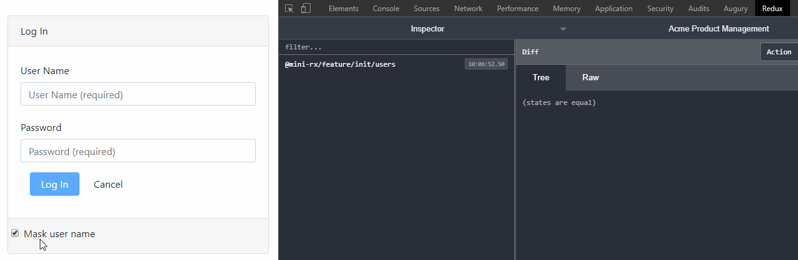

[](https://www.npmjs.com/package/mini-rx-store)
[](https://github.com/spierala/mini-rx-store/actions?query=workflow%3ATests)

# MiniRx: The RxJS Redux Store

**MiniRx Store** provides Reactive State Management for Javascript Applications.

## RxJS
MiniRx is powered by [RxJS](https://rxjs.dev/). It uses RxJS Observables to notify subscribers about state changes.

## Redux

MiniRx uses the Redux Pattern to make state management easy and predictable.

The Redux Pattern is based on this 3 key principles:

-   Single source of truth (the Store)
-   State is read-only and is only changed by dispatching actions
-   Changes are made using pure functions called reducers

## MiniRx Features

-   Minimal configuration and setup
-   "Redux" API:
    - Actions
    - Reducers
    - Memoized Selectors
    - Effects
-   "Feature" API   :
    -   `setState()` update the feature state
    -   `select()` read feature state
    -   `createEffect()` run side effects like API calls and update feature state
-   Support for [Redux Dev Tools](https://github.com/zalmoxisus/redux-devtools-extension)
-   Framework agnostic: Works with any front-end project built with JavaScript or TypeScript (Angular, React, Vue, or anything else)

## Usage

#### Installation:

`npm i mini-rx-store`

#### Create the Store (App State):

The `Store` is created and ready to use as soon as you import `Store`.

`import { Store } from 'mini-rx-store';`

#### Create a Feature (Feature State):

A `Feature` holds a piece of state which belongs to a specific feature in your application (e.g. 'products', 'users').
The Feature States together form the App State (Single Source of Truth).

Usually you would create a new `Feature` inside long living Modules/Services:

```
import { Store } from 'mini-rx-store';
import { initialState, ProductState, reducer } from './state/product.reducer';
...
// Inside long living Module / Service
constructor() {
    Store.feature<ProductState>('products', initialState, reducer);
}
```

The code above creates a new Feature State for _products_.
`Store.feature` receives a feature name, a initial state and a reducer function.

Initial state example:
```
export const initialState: ProductState = {
  showProductCode: true,
  products: [],
};
```

Reducers specify how the application's state changes in response to actions sent to the store.
A reducer function typically looks like this:
```
export function reducer(state: ProductState, action: ProductActions): ProductState {
  switch (action.type) {
    case ProductActionTypes.ToggleProductCode:
      return {
        ...state,
        showProductCode: action.payload
      };

    default:
      return state;
  }
}
```

#### Create an Action:

```
import { Action } from 'mini-rx-store';

export enum ProductActionTypes {
  CreateProduct = '[Product] Create Product',
}

export class CreateProduct implements Action {
  readonly type = ProductActionTypes.CreateProduct;
  constructor(public payload: Product) { }
}
```

#### Dispatch an Action:
Dispatch an Action to update state:
```
import { Store } from 'mini-rx-store';
import { CreateProduct } from 'product.actions';

Store.dispatch(new CreateProduct(product));
```
After the action has been dispatched the state will be updated accordingly (as defined in the reducer function).

#### Write an effect:

Effects handle code that triggers side effects like API calls:

-   An Effect listens for a specific Action
-   That Action triggers the actual side effect
-   The Effect needs to return a new Action as soon as the side effect finished

```
import { Action, actions$, ofType } from 'mini-rx-store';
import { mergeMap, map, catchError } from 'rxjs/operators';
import { LoadFail, LoadSuccess, ProductActionTypes } from './product.actions';
import { ProductService } from '../product.service';

constructor(private productService: ProductService) {
    Store.createEffect(
        actions$.pipe(
            ofType(ProductActionTypes.Load),
            mergeMap(() =>
                this.productService.getProducts().pipe(
                    map(products => (new LoadSuccess(products))),
                    catchError(err => of(new LoadFail(err)))
                )
            )
        )
    );
}
```

The code above creates an Effect. As soon as the `Load` Action is dispatched the API call (`this.productService.getProducts()`) will be executed. Depending on the result of the API call a new Action will be dispatched:
`LoadSuccess` or `LoadFail`.

#### Create (memoized) Selectors:

Selectors are used to select and combine state.

```
import { createFeatureSelector, createSelector } from 'mini-rx-store';
import { ProductState } from './product.reducer';

const getProductFeatureState = createFeatureSelector<ProductState>('products');

export const getProducts = createSelector(
    getProductFeatureState,
    state => state.products
);
```

`createSelector` creates a memoized selector. This improves performance especially if your selectors perform expensive computation.
If a selector is called with the same arguments again, it will just return the previously calculated result.

#### Select Observable State (with a memoized selector):

```
import { Store } from 'mini-rx-store';
import { getProducts } from '../../state';

this.products$ = Store.select(getProducts);
```

`select` runs the selector on the App State and returns an Observable which will emit as soon as the _products_ data changes.

## Make simple things simple - The `Feature` API

If a Feature in your application requires only simple state management, then you can fall back to a simplified API: With the `Feature` API you can update state without writing Actions and Reducers.

#### Create a Feature (Feature State):

To create a Feature, you need to extend MiniRx's `Feature` class, passing the feature name as well as its initial state.

```
export class UserStateService extends Feature<UserState>{
    constructor() {
        super('users', initialState);
    }
}
```

#### Select state with `select`

**`select(mapFn: ((state: S) => any)): Observable<any>`**

Example:

```
maskUserName$: Observable<boolean> = this.select(state => state.maskUserName);
```

`select` takes a callback function which gives you access to the current feature state (see the `state` parameter).
Inside of that function you can pick a certain piece of state.
The returned Observable will emit the selected data over time.

#### Update state with `setState`

**`setState(stateFn: (state: S) => S | state: Partial<S>, name?: string): void`**

Example:

```
// Pass callback to setState
updateMaskUserName(maskUserName: boolean) {
    this.setState((state) => {
        return {
            ...state,
            maskUserName
        }
    });
}

// Or pass the new state object directly (in case the current state is not needed to calculate the new state)
updateMaskUserName(maskUserName: boolean) {
    this.setState({maskUserName});
}
```

`setState` takes a callback function which gives you access to the current feature state (see the `state` parameter).
Inside of that function you can compose the new feature state.

Alternatively `setState` accepts a new state object directly.

For better logging in the JS Console / Redux Dev Tools you can provide an optional name to the `setState` function:

`this.setState({ showProductCode }, 'showProductCode');`

#### Create an Effect with `createEffect`

**`createEffect<PayLoadType>(effectFn: (payload: Observable<PayLoadType>) => Observable<(state: S) => S | state: Partial<S>>, effectName?: string ): (payload?: PayLoadType) => void`**

Example:

```
deleteProductFn = this.createEffect<number>(
    payload$ => payload$.pipe(
        mergeMap((productId) => {
            return this.productService.deleteProduct(productId).pipe(
                map(() => state => { // Return callback which calculates the new state
                    return {
                        ...state,
                        products: state.products.filter(product => product.id !== productId),
                        error: ''
                    }
                }),
                catchError(err => of({error: err})) // Or return the new state object directly
            )
        })
    ),
    'delete' // Used for logging / Redux Dev Tools
);

// Run the effect
deleteProductFn(123);
```

The code above creates an Effect for _deleting a product_ from the list. The API call `this.productService.deleteProduct(productId)` is the side effect which needs to be performed.
`createEffect` returns a function which can be called later to start the Effect with an optional payload (see `deleteProductFn(123)`).

`createEffect` takes 2 arguments:

-   **`effectFn: (payload$: Observable<PayLoadType>) => Observable<(state: S) => S | state: Partial<S>>`**:
    Within the `effectFn` you can access the `payload$` Observable.
    That Observable emits as soon as the Effect has started (e.g. by calling `deleteProductFn(123)`).
    You can directly `pipe` on the `payload$` Observable to access the payload value and do the usual RxJS things to run the actual Side Effect (`mergeMap`, `switchMap` etc).
    When the side effect completed you can directly return the new state or return a callback function which gets the current state and returns a new state.

-   **`effectName: string`**:
    ID which needs to be unique for each effect. That ID will show up in the logging (Redux Dev Tools / JS console).

#### Select Observable State (with a memoized selector):
You can use memoized selectors also with the `Feature` API... You only have to omit the feature name when using `createFeatureSelector`.
This is because the Feature API is operating on a specific feature state already (the corresponding feature name has been provided in the constructor). 

```
const getProductFeatureState = createFeatureSelector<ProductState>(); // Omit the feature name!

const getProducts = createSelector(
    getProductFeatureState,
    state => state.products
);

// Inside the Feature state service
export class ProductStateService extends Feature<ProductState>{
    this.products$ = this.select(getProducts);

    constructor(private productService: ProductService) {
        super('products', initialState); // Feature name 'products' is provided here already...
    }
}
```

#### FYI: How the Feature API works

Also the `Feature` API makes use of Redux:
Each Feature is registered in the Store (Single Source of Truth) and is part of the global App State.
Behind the scenes `Feature` is creating a default reducer, and a default action in order to update the feature state.
When you use `setState()` or when the feature´s effect completed, then MiniRx dispatches the default action, 
and the default reducer will update the feature state accordingly.

See the default Action in the Redux Dev Tools:



## Settings

#### Enable Logging of Actions and State Changes in the Browser Console:

```
import { Store } from 'mini-rx-store';

Store.settings({enableLogging: true});
```

The code above sets the global Store Settings.
`enableLogging` is currently the only available setting.
Typically, you would set the settings when bootstrapping the app and before the store is used.

## Redux Dev Tools:


MiniRx has basic support for the Redux Dev Tools (you can time travel and inspect the current state).
You need to install the Browser Plugin to make it work.

-   [Chrome Redux Dev Tools](https://chrome.google.com/webstore/detail/redux-devtools/lmhkpmbekcpmknklioeibfkpmmfibljd)
-   [Firefox Redux Dev Tools](https://addons.mozilla.org/nl/firefox/addon/reduxdevtools/)

Currently, these options are available to configure the DevTools:
* `name`: the instance name to be shown on the DevTools monitor page.
* `maxAge`: maximum allowed actions to be stored in the history tree. The oldest actions are removed once maxAge is reached. It's critical for performance. Default is 50.
* `latency`: if more than one action is dispatched in the indicated interval, all new actions will be collected and sent at once. Default is 500 ms.


#### Installation (Angular):
[](https://www.npmjs.com/package/mini-rx-ng-devtools)

`npm i mini-rx-ng-devtools`

#### Add DevTools to Angular

```
import { NgReduxDevtoolsModule } from 'mini-rx-ng-devtools';

@NgModule({
    imports: [
        NgReduxDevtoolsModule.instrument({
            name: 'MiniRx Showcase',
            maxAge: 25,
            latency: 1000
        })
    ]
    ...
})
export class AppModule {}
```

#### If you do not use Angular

```
import { Store, ReduxDevtoolsExtension } from 'mini-rx-store';

Store.addExtension(new ReduxDevtoolsExtension({
    name: 'MiniRx Showcase',
    maxAge: 25,
    latency: 1000
}));
```

## Showcase

This Repo contains also an Angular showcase project.

Run `npm i`

Run `ng serve mini-rx-store-showcase --open` to see MiniRx in action.

The showcase is based on the NgRx example from Deborah Kurata: https://github.com/DeborahK/Angular-NgRx-GettingStarted/tree/master/APM-Demo5

I did a refactor from NgRx to MiniRx, and the app still works :)

## References

These projects, articles and courses helped and inspired me to create MiniRx:

-   [NgRx](https://ngrx.io/)
-   [Akita](https://github.com/datorama/akita)
-   [Observable Store](https://github.com/DanWahlin/Observable-Store)
-   [RxJS Observable Store](https://github.com/jurebajt/rxjs-observable-store)
-   [Basic State Managment with an Observable Service](https://dev.to/avatsaev/simple-state-management-in-angular-with-only-services-and-rxjs-41p8)
-   [Redux From Scratch With Angular and RxJS](https://www.youtube.com/watch?v=hG7v7quMMwM)
-   [How I wrote NgRx Store in 63 lines of code](https://medium.com/angular-in-depth/how-i-wrote-ngrx-store-in-63-lines-of-code-dfe925fe979b)
-   [Pluralsight: Angular NgRx: Getting Started](https://app.pluralsight.com/library/courses/angular-ngrx-getting-started/table-of-contents)
-   [Pluralsight: RxJS in Angular: Reactive Development](https://app.pluralsight.com/library/courses/rxjs-angular-reactive-development/table-of-contents)
-   [Pluralsight: RxJS: Getting Started](https://app.pluralsight.com/library/courses/rxjs-getting-started/table-of-contents)

## License

MIT

## Created By

If you like this, follow [@spierala](https://twitter.com/spierala) on twitter.
